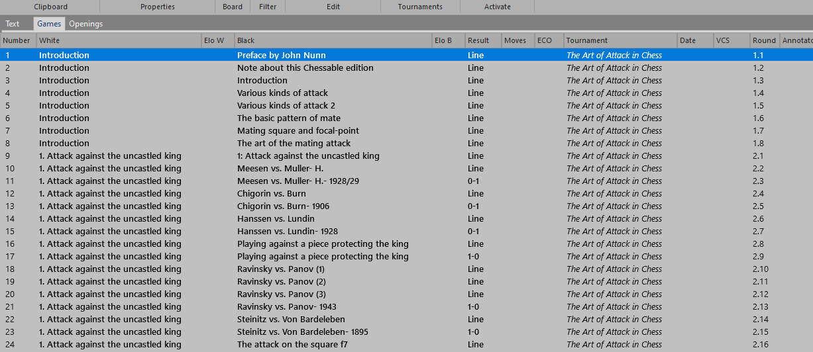

Chessable to PGN Tooling
-
- Installation
- First Time Setup
- Usage
- PGN Tags Generated
- Performance and Operational Notes
- Release Notes
- Open Items
- Testing and obvious notes

Installation
-
This tool uses several helpers to perform its job:

- A reasonably recent Python install - tested on 3.13.3 - have done no testing on other versions
- External dependencies
  - Chrome for Testing (which requires node to install the current stable version)
    - if you don't have node/npm installed, go here: https://nodejs.org/en/download
    - To get the lastest stable version of Chrome for Testing, run this at a prompt that can see npm:
      - npx @puppeteer/browsers install chrome@stable
      - take note of the install location and version (see setup)
- Python packages
  - These can just be installed as a regular Python packages (use your favorite package manager)
  - We recommend (as always) using a bespoke conda or venv environment for all Python projects
    - selenium
    - selenium-manager
    - beautifulsoup4
  
First Time Setup
-
- In "configdata.py" set the following variables:
    - CHROME_FOR_TESTING_BINARY_LOC
      - the location of the binary you just installed, should look something like:
      - "C:/Users/john/chrome/win64-135.0.7049.114/chrome-win64/chrome.exe"
    - TESTING_PROFILE_BASE_DIR
      - The location that binary will look for profile data, should look something like:
      - "C:/Users/<user>/AppData/Local/Google/Chrome for Testing/User Data"
    - TESTING_PROFILE - the profile this browser should use - likely can leave as "Default"
    - The next two variables can also be set via command line parameters
      - HTML_CACHE_PATH - the place that read html files will be stored - default is './html/'
        - `./html/course`
          - this is where course page html files are stored by course ID, like 24575.html
        - `./html/course/<courseID>`  
          - this folder holds the retrieved html that course's chapter pages - 1/chapter
        - `./html/course/<courseID>/variation`  
          - this folder holds all of the variation html files are stored 1/variation
        - `/.html/course/one-off/variation`  
          - this folder holds variation htmls loaded/processed directly (see usage)
      - PGN_CACHE_PATH - the place that generated pgn files will be stored - default is './pgn/'
        - `./pgn/course`     
          - this folder holds files - one per course - containing all variations as pgn, like 24575.pgn
        - `./pgn/variation`  
          - this folder holds files - one per variation - containing that id's variation as pgn, like 38877075.pgn
    - Chrome for Testing Setup
      - you will want to take the executable for Chrome for Testing (the one referenced in CHROME_FOR_TESTING_BINARY_LOC) and 
    run it directly.  A browser window will open.  Set up a profile for testing (can be any ID you want - the point is
    not to use your personal profile...)
      - While in this profile, log into chessable using your credential.  This is how selenium will access chessable.  Once you
    have done this and can see your courses, etc., you can shut the browser down.

Usage
- 
- This is a command line tool that can be run at a prompt or from within an IDE:
  - the entry point is chessable-to-pgn.py, and your command line will look something like:
    - `python chessable-to-pgn.py <set courses and variations> <file processing> <set html and pgn file locations> <set other operation params>`
- Most uses will be in batch mode (which is the default), but there is a minimal interactive mode that can be entered with the flag `interactive`:
  - `python chessable-to-pgn.py -interactive`
  - in this mode you will be prompted for what you'd like to do...
- To set courses and variations:
  - `-courses` flag is followed by the course ids to process
    - Example: `python chessable-to-pgn.py -courses 42579 57374` would process the "Sac, Sac, Mate!" (42579) and "Chess 
    Swindles: Sample Lesson" (57374) courses.
  - `-variations` flag is followed by the variation ids to process
    - Example: `python chessable-to-pgn.py -variations 8318178` would process one variation from chapter 4 in the "Sac, Sac, Mate!" course.
  - you can provide multiple IDs for each flag, and you can use both flags at once:
    - Example: this processes the courses and variations above in one command - `python chessable-to-pgn.py 
    -courses 42579 57374 -variations 8318178`
- File Processing:
  - the `-web` and `-pgn` flags determine how/when the tool fetches html and writes pgn files:
    - values for `-web` include:
      - `update` (default), looks for html files in `htmlRoot` and uses it if it exists, otherwise fetches it from the web 
      - `all` always fetches html files as needed, overwriting any existing files 
      - `none` uses existing html files if they exist, otherwise skips the relevant course/chapter/variation 
    - values for `-pgn` include:
      - `incremental` (default), writes/updates the output pgn file(s) in `pgnRoot` as variations are fetched and processed 
      - `after` fetches all requested html files first (if any), then writes all requested pgn data afterwards
      - `none` does not write any pgn for this run
    - Example: `python chessable-to-pgn.py -courses 42579 57374 -web all -pgn after` would fetch the full html for both 
    specified courses, overwriting any preexisting html files, then write all pgn for both courses.  
  - Additionally, the `-key` (default) and `-noKey` flags determine whether the first Chessable "key" move is marked in 
  the PGN, with the string comment " -KEY- " 
- To set html and pgn file locations:
  - `htmlRoot` flag sets the base for where the tool will write HTML files.  The default is `./html/`
  - `pgnRoot` flag sets the base for where the tool will write HTML files.  The default is `./pgn/`
  - for all locations with spaces, enclose the path in quotes:
    - Example showing both styles: `python chessable-to-pgn.py -variations 8318178 -htmlRoot "c:/my files/html/" -pgnRoot c:/pgnData`
  - You can also change these default locations permanently in ConfigData.py.
- To set other operational parameters related to the browser and session for selenium to use, use the following flags:
  - `-browserbinary` changes the location of the browser binary to use.  
    - Typically this will be where you installed the Chrome for Testing instance (see setup)
    - You should change this default location permanently in ConfigData.py (see setup).
  - `-browserprofiledir` changes the location of the profile directory the browser will use.  
    - This is be system dependent - on Windows it's in `"C:/Users/<user>/AppData/Local/Google/Chrome for Testing/User Data"`
    - You should change this default location permanently in ConfigData.py (see setup).
  - `-browserprofile` changes the actual profile the browser will use. `Default` is the default and you should not likely need to change this.  

PGN Tags Generated
-
- A typical PGN has a Seven Tag Roster (STR) associated with it.  Not all of these make sense in this context, and we have 
extra info to share, so these tags have been co-opted...  Example STR and explanation: 
  - `[Event "The Checkmate Patterns Manual"]`  -- this tag has the course name that this variation belongs to
  - `[Site "chessable.com/variation/38877075/"]`  -- this tag has the url that points to this specific variation
  - `[Date "????.??.??"]` -- undefined, but the tag is required by many readers so this is provided as shown
  - `[Round "x.x"]`       -- This shows the chapter and variation in that chapter.  ex 4th var in the 3rd chapter would 
  be "3.4".  These are ORDINAL numbers based on their positions as listed in the course, and do not correspond to any goofy
  chapter or variation numbering scheme used by the author
  - `[White "1. Introduction"]`          -- this tag has the chapter name for this variation
  - `[Black "Next steps after mastering this course"]`          -- this tag has this variation's title
  - `[Result "*"]`        -- accurate if variation supplies it. Most don't - "*" is used in that case.
  - `[FEN " - some fen string - "]`        -- this is only written when a variation does not start at the normal chess opening position
- Note that for player names (`"White"` and `"Black"` tags), most readers split the strings into first/last name depending 
on location of the first "," character.  To avoid this, all "," characters in actual chapter or variation name text are 
replaced with "-".
- This leads to PGN collections that look like this in ChessBase, with the course name to the right in the "Tournament" column, 
Chapters down the left side,variations just to their right, all in lexical order.  The Round column
reflects this order as well (as in the tag description above): 
  - 

Performance and Operational Notes
-
- This tool is as fast as it can be, given that it's pulling dynamically assembled HTML from a server that isn't always that responsive.
- It can take 12-15 sec to get the final HTML and parse it into something usable
- This means that if you have a course with 150 variations across 7 chapters:
  - it's 158 HTML pulls (1 for the course, 1 for each chapter, 1 for each variation)
  - that's a nominal range of 158 * 12-15 sec, or 31.6 to 39.5 min.  
  - It's still much faster than you typing it in yourself.
    - That's a joke. They used to say that the C-1541 disk drive was only a little faster than you typing the code yourself into a C-64...and not quite as reliable.  I know...it's really just too funny to include on a page noone will ever see....
  - it does a good job of:
    - running unattended, so as long as your computer doesn't sleep, you can let really long runs (several courses??) run overnight and your pgn will be magically available in the am
    - restarting interrupted jobs, so if it detects that it's already downloaded the html, it will use the local copy instead.  Just issue the same command and it will scan its local cache as needed
      - This means that if variations get added to your course, you likely need to delete the course and/or chapter files for that course. (chapters are defined from the course file, and variations from the chapter files...).
      - This also means that if variations change (but keep the same id - no idea if this ever actually happens), then deleting that variation file and rerunning the course will cause that variation (only) to be repulled and processed. 
- All PGN is generated from scratch on every run, so the `<courseID>.pgn` file always contains all variations, in course order. 
- The good news is that once it's cached locally, if you need to rerun the PGN generator, it takes almost no time per page...
  - As the tool improves and the PGN is more useful, you can use the `pgn` option to just rerender the PGN from your cached html files. 
- The better news is that once I figure out how to properly multitask selenium, speed will improve.

Release Notes
- 
- v0.31 - 05-May-2025
  - added code to write " -KEY- " before first key move in a variation, and command line flags to enable/disable this functionality
- v0.30 - 01-May-2025
  - support to write FEN when variations don't start at the normal start position
  - big code cleanup and change in user interface to make it easier to use
  - changed modes and made flags specifying how to handle html and pgn simpler
  - exposed all operational parameters to make it easier to test
  - made interactive mode a little easier to use
  - broke command line and other utilities into separate modules
  - added better documentation to source files
  - made feedback (and this file) current and a little friendlier
- v0.20 - 29-Apr-2025 - quantum improvement in capability, close to ready for prime-time
  - added the most basic possible interactive mode - the tool runs nicely from a desktop shortcut :)
  - changed default mode to incremental pgn generation in batch mode
  - fixed STR / PGN tags so they are more useful in ChessBase
  - cleanup of nested variations, including when they are "continuations"
  - better error reporting / exception handling
  - clean up this file (ReadMe.md) to be a little more readable and useful.
  - added `license.txt` file to reflect that this tool is covered by the MIT license.
- v0.11 - 28-Apr-2025
  - First pass at handling move and board eval NAGs as well as game results (so inconsistent in courses)
  - much closer to release-ready
  - Generally handles (properly) nested variations well.  The two edge cases I know of that still mess it up are
    - noted that occasionally the first move of a variation is a continuation, not an alternate move as defined in the spec, which correctly breaks PGN readers (including ChessBase).  The fix would be to re-enter the last move before the variation started
    - as mentioned before, also within a variation is repeated.  "g4 wins like this: g4 ..."  The fix here would be to not emit the second move.
    - the problem is I've tried hard NOT to keep game state or validate positions, since that's so heavyweight.  Will see if there's a quick fix 
      - would keeping the last emitted FEN be good enough for this?  Not formally, there could be N nested "continuations", but that's not the usage I've seen... will try it out
- v0.10 - 27-Apr-2025 - absolutely a pre-release version
  - Set the tool up its own standalone repo
  - Does a good job of fetching html, and generates passable PGN for simple game files
  - Known issues
    - Does not handle complex, nested variations well
    - There are cases where the author says something like this in a comment:
      - "now we try 13. g4 which attempts to bust open the K-side like this: 13. g4 Nf3 ..."
      - the repeated g4 move is in the same variation comment in the html twice, which would translate to an illegal move
      - I've seen this several times - will release a fix when it's available
    - Does not yet properly handle game terminators/results correctly
    - No support for diacritic or evaluation glyphs.  These were handled in the (old) .net version, and will be eventually ported to this version as well.
    - Multiprocessing does not work.  Skeletal code to create/destroy profiles exists, but these should not be required.  Work will continue.  This one fix will significantly cut overall translation time significantly. 
    - May add support for chapter batches in addition to variations and courses.  Might be more manageable.  Or just fix multiprocessing... 

Open Items
- 
- Repeated moves in variation (very rare situation, 0 cases found across 8 full courses in testing)
- multiprocessing support is broken
- ... I think that's it ...
- if you find something, fix it and send a pull request.  Email (below) may not be replied to in a timely manner...

Testing and Obvious Notes
-
- To test this, I would start with one variation from a small course so that you can establish that the tool is setup 
correctly.  I've tried to explain how to do that, but there's no support, warranty or other channel to help you if you
have trouble, except maybe Reddit.  Good luck.
  - (you can try email to chess at demastri dot com if you're really stuck, but it isn't regularly monitored)
- After running the tool and possibly stopping it prematurely, the tool occasionally returned 
`error in loadHtmlFromWeb for <"+url+"> on attempt 1-3`, failing after 3 attempts.  
  - Before looking at anything in the code, check that there are no instances of `Chrome for Testing` 
  running in Task Manager (on Windows).
  - A known issue with Selenium (and the reason for the Chrome for Testing browser):
    - it fails if more than one browser process is running or if more than one session in that process attempts to write
    to the same profile.  Check this first if you start seeing errors. 
    - you could use your "normal" Chrome install, but you'd have to be sure all other Chrome processes are killed first, 
    and you can't use it while the tool is running.  That stinks.  Use the Chrome for Testing browser. 
- This tool is intended to let you get more utility from ONLY the courses YOU have access to so that you can better utilize content you already 
own (think: use a version of your 1 e4 rep course in SCID or Chessbase).  This is why YOU have to set up the browser with your
chessable credentials.  Good luck with better leveraging of your rep in correspondence games, etc...
- It is NOT intended to help share content you don't already own. If you're sharing chessable credentials, or
sharing the output of the tool with people that don't have access, you're violating chessable's terms of service, and just
making the world a worse place, overall.  You're why we can't have nice things.  Kill yourself.
- It is a consequence of modern development that this file is larger (in overall size) than any of the code files in the repo...
- This code is (c) 2025 John DeMastri, usage is covered by the MIT License, see the License.txt file for your rights and obligations.